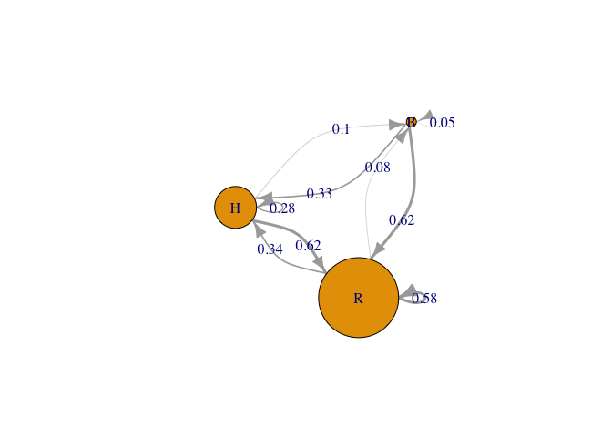

Markov Chain Example
================
Marco Smolla
3/22/2021

## What is a Markov Chain?

Markov Chains describe the transition probabilities of a system from one
state to another. For example, if a system has the state ‘activated’,
‘stand-by’, and ‘deactivated’, what is the probability to go from
‘stand-by’ to ‘activated’, and so on. For more information, make sure
to take a look at the corresponding [Wikipedia
entry](https://en.wikipedia.org/wiki/Markov_chain) and these [lecture
notes](https://www.stat.auckland.ac.nz/~fewster/325/notes/ch8.pdf).

## Which packages do we need?

There are a bunch of good `R` packages out there. Here, I am relying on
`markovchain` and for plotting I will use `igraph`.

``` r
# For calculating markov chains 
library(markovchain) 
```

    ## Package:  markovchain
    ## Version:  0.8.5-4
    ## Date:     2021-01-07
    ## BugReport: https://github.com/spedygiorgio/markovchain/issues

``` r
# For plotting as a network
library(igraph) 
```

    ## 
    ## Attaching package: 'igraph'

    ## The following objects are masked from 'package:stats':
    ## 
    ##     decompose, spectrum

    ## The following object is masked from 'package:base':
    ## 
    ##     union

## Example data

Here is our example data:

``` r
# Example transitions for a single individual (H=helper, R=recprocator, B=benefactor)
x <- sample(c("H", "R", "B"), 1000, replace = T, prob=c(.30, .60, .10)) # here I am creating a random vector of states (which in your case would be the sequence of states of your individual buyers)

# Count: 
table(x)
```

    ## x
    ##   B   H   R 
    ## 110 279 611

``` r
# Proportion
table(x)/length(x)
```

    ## x
    ##     B     H     R 
    ## 0.110 0.279 0.611

## Calculating a transition matrix - the packaged way

If you prefer to use a ready made function, use the `markovchainFit()`
function from the `markovchain` package:

``` r
# using markovchainFit from the markovchain pacakge
mcFit <- markovchainFit(data=x)
# look at results
show(mcFit)
```

    ## $estimate
    ## MLE Fit 
    ##  A  3 - dimensional discrete Markov Chain defined by the following states: 
    ##  B, H, R 
    ##  The transition matrix  (by rows)  is defined as follows: 
    ##            B         H         R
    ## B 0.05454545 0.2636364 0.6818182
    ## H 0.12544803 0.2724014 0.6021505
    ## R 0.11311475 0.2836066 0.6032787
    ## 
    ## 
    ## $standardError
    ##            B          H          R
    ## B 0.02226809 0.04895604 0.07872958
    ## H 0.02120459 0.03124659 0.04645692
    ## R 0.01361742 0.02156221 0.03144808
    ## 
    ## $confidenceLevel
    ## [1] 0.95
    ## 
    ## $lowerEndpointMatrix
    ##            B         H         R
    ## B 0.01090079 0.1676843 0.5275110
    ## H 0.08388779 0.2111592 0.5110966
    ## R 0.08642510 0.2413454 0.5416416
    ## 
    ## $upperEndpointMatrix
    ##            B         H         R
    ## B 0.09819012 0.3595885 0.8361254
    ## H 0.16700826 0.3336436 0.6932045
    ## R 0.13980440 0.3258677 0.6649158
    ## 
    ## $logLikelihood
    ## [1] -895.911

# Calculating a transition matrix - DIY

Alternatively, we can build our own `trans.matrix()` function:

``` r
trans.matrix <- function(X, prob=T)
{
 # turn sequence into a factor 
 if(!is.factor(x)) x <- as.factor(x)
 # define individual levels of the factor
 ids <- levels(x)
 # create an empty ids x ids matrix
 m <- matrix(0, ncol=length(ids), nrow=length(ids))
 # turn sequence into levle numbers (1, 2, 3, ...)
 state <- as.numeric(x)
 # create a two column matrix where the first column are t and the second column t+1 entries 
 tmp <- cbind(state[-length(state)], state[-1])
 # add up all individual transitions (i.e. at t the state is 1 and at t+1 the state is 2, then add 1 to the number in the matrix M_12)
 for(i in 1:nrow(tmp)){
  m[tmp[i,1], tmp[i,2]] <- m[tmp[i,1], tmp[i,2]] + 1
 }
 # turn counts into probabilities
 if(prob) m <- m / rowSums(m)
 # turn matrix into data.frame with column names and row names 
 df <- data.frame(m, row.names = ids)
 colnames(df) <- ids
 # return transitio matrix
 return(df)
}
```

Let us test this function with out initial sequence `x`:

``` r
# calculate transition matrix
mcFit2 <- trans.matrix(x)
mcFit2
```

    ##            B         H         R
    ## B 0.05454545 0.2636364 0.6818182
    ## H 0.12544803 0.2724014 0.6021505
    ## R 0.11311475 0.2836066 0.6032787

Compare `mcFit2` with the estimate of `mcFit` and you’ll see that this
produces the same result. Of course, when using the markovchain package
you receive much more information than the transition matrix.

## Plot transition matrix as a graph

Finally, let us plot the result as an `igraph` network:

``` r
# turn transition matrix into a network
net <- graph_from_adjacency_matrix(adjmatrix = as.matrix(mcFit2), weighted = T)
# plot transiton matrix as network
plot(net, 
     edge.width=E(net)$weight*5, # use transition probabilities to vary edge widths
     edge.curved=T, # make edges curved (instead of straight)
     # vertex.size=50, # this is for fixed vertex size
     vertex.size=colSums(mcFit2)*50, # use in-edge weights (i.e. column sums of the transition matrix) to set the size of a vertex (larger vertices have larger weights of incoming edges)
     edge.label=round(E(net)$weight, 2)) # add transition probabilities as labels to all edges (and round values to make it easier to read)
```

<!-- -->
